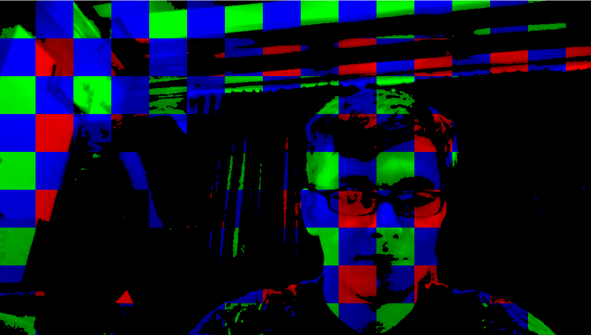
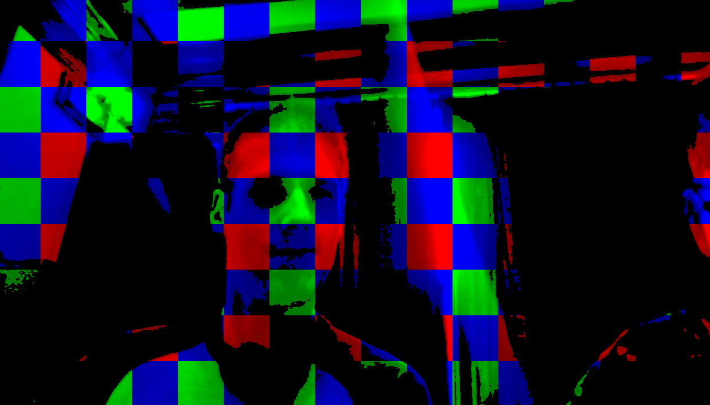

# CrazyGrid
CrazyGrid is a digital mirror which applies red, green, and blue thresholds to the webcam filter, in a grid pattern. CrazyGrid works by:
1. Going through each pixel and figuring out whether the 80x80 gridspace it falls into has a remaineder of 0, 1, or 2 when divided by 3.
1. Taking each pixel in the gridspace, and depending on what color it's thresholding, turns every pixel black unless it has a value above 120 for the selected color.

# Screenshots
;
;
